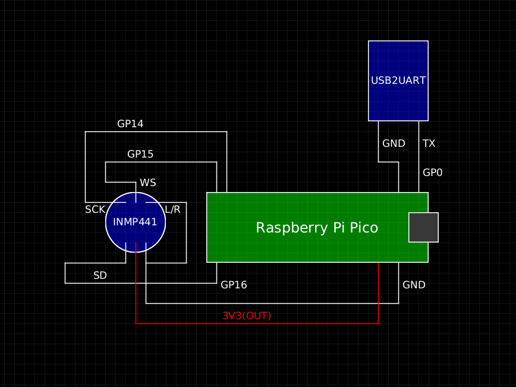
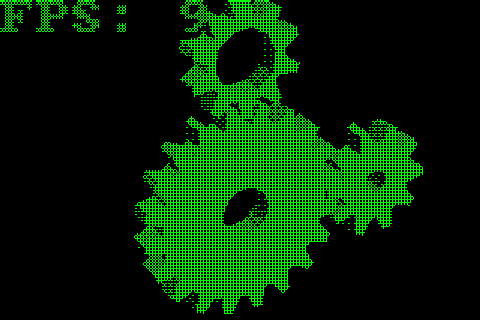
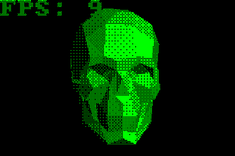
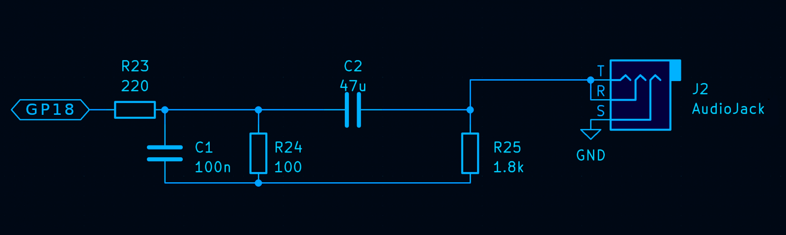

# rp2040_pico_sdk_playground

[](https://github.com/mryndzionek/rp2040_pico_sdk_playground/actions/workflows/build.yml)

## Building

```
git submodule update --init --recursive
export PICO_SDK_PATH=/path/to/your/pico-sdk
mkdir build
cd build
cmake ..
make
```

More complete info can be extracted from GitHub action [script](.github/workflows/build.yml).

## Applications

### rpi_lcd_test


A simple app demonstrating the use of PIO and DMA for
efficient data transfers to a 480x320 TFT display.
The graphics library creates a monochromatic image
in memory which is expanded to 16-bit color codes
in PIO block and transferred via 8-bit parallel
interface.

### rpi_ws2812_lamp

A simple app controlled by one button, controlling
a WS2812 strip/matrix. Can be used to test strips/matrices.

| Button press/sequence | Action                             |
|-----------------------|------------------------------------|
| Hold                  | Adjust brightness                  |
| Tap and hold          | Adjust color                       |
| One tap               | Toggle 3-minute timer              |
| Two taps              | Toggle between 'Off' and 'Max Red' |
| Three taps            | Cycle through presets              |


### rpi_inmp441_fft_demo

Reading audio from a INMP441 MEMS microphone using PIO+DMA,
computing fixed point FFT (CMSIS-DSP) and displaying an ASCII
spectrogram on serial.

https://github.com/mryndzionek/rp2040_pico_sdk_playground/assets/786191/143725ea-1283-4246-8fa4-98fe817371da

https://github.com/mryndzionek/rp2040_pico_sdk_playground/assets/786191/5a73f16c-892f-4e6c-8581-af352b213908

### rpi_tflm_micro_speech_demo

#### /Keyword Spotting/Visual Wake Words/ on RP2040

TFLM [Micro Speech](https://github.com/tensorflow/tflite-micro/blob/main/tensorflow/lite/micro/examples/micro_speech/train/README.md)
model is ported to Raspberry Pi Pico (RP2040, Cortex-M0+). Sound is from a MEMS
I2S microphone (INMP441). The CPU is clocked at 250MHz. Data from
the microphone is transferred using PIO+DMA. With this configuration real-time
speech analysis is possible (stride is 20ms at 16kHz sample rate and single inference takes ~19ms).

https://github.com/mryndzionek/rp2040_pico_sdk_playground/assets/786191/eb2e00cd-766a-4e30-b1a9-e1439eccf761

### rpi_inmp441_kws

TinyML keyword spotting demo. The model is [Shallow RNN](https://github.com/microsoft/EdgeML/blob/master/docs/publications/Sha-RNN.pdf)
architecture with a [FastGRNN](https://github.com/microsoft/EdgeML/blob/master/docs/publications/FastGRNN.pdf) cell converted
to ~200 lines of C code.
At 280MHz Core0 is setting up DMA transfers from I2S microphone
and doing feature extraction (`dc blocking` -> `preemphasis` -> `FFT` -> `power` -> `log` -> `Mel filterbank`)
in frames, nine frames a second.


The core utilization is ~70%.
Core1 every 105ms does NN inference which takes about 85ms (77% core utilization).

The microphone (INMP441) connections are as follows:



### rpi_lcd_3d_test

[tinygl_1b](https://github.com/meadiode/tinygl_1b) test app (dithered `glxgears`)

https://github.com/user-attachments/assets/f5792bb0-ef3a-4614-b5db-952d4316804c



### rpi_lcd_3d_skull_test

[tinygl_1b](https://github.com/meadiode/tinygl_1b) test app - model exported from Blender.



### pitchshifter

Real time /pitch shifter/voice changer/ application. Pitch shifting code generated in [Faust](https://faust.grame.fr/).
As a bonus there are also vibrato and echo effects. Short button presses cycle through the pitch levels.
Long button press between 500ms-2000ms activates and deactivates echo.
Button press longer than 2000ms activates the vibrato.

Example recording:


INMP441 microphone connections are like in the `rpi_inmp441_kws` application:


Audio output via GPIO PWM pin with a low-pass filter:



LM386 or PAM8403 can be used to amplify further, to connect a speaker.
A tact switch needs to be connected between `GP13` and `GND`.

